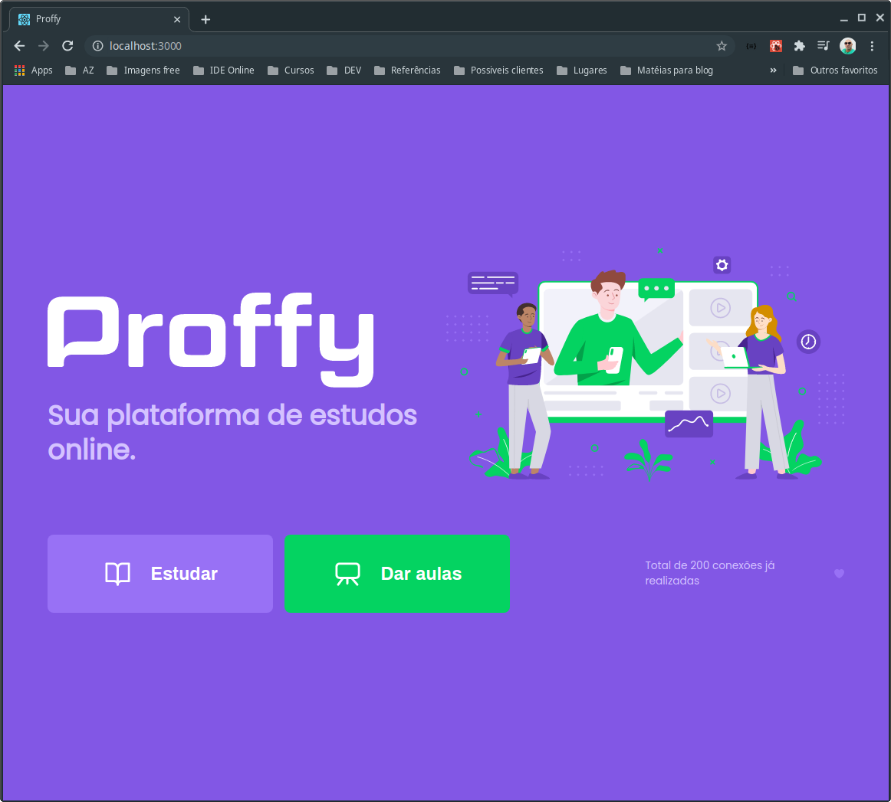

<div align="center">
  

 :rocket: *Projeto desenvolvido para conectar estudantes e alunos.*
  </div>

# :pushpin: Contéudo do projeto

- [Tecnologias](#computer-technologies)
- [Como executar](#construction_worker-how-to-run)
- [Licença](#closed_book-license)

# :computer: Tecnologias

Este projeto usa as seguintes tecnologias:

<ul>
  <li><a href="https://nodejs.org/en/docs/">NodeJs</a></li>
  <li><a href="https://www.typescriptlang.org/">Typescript</a></li>
  <li><a href="https://pt-br.reactjs.org/">React</a></li>
  <li><a href="https://reactnative.dev/">React Native</a></li>
  <li><a href="https://expo.io/">Expo</a></li>
</ul>

# :construction_worker: Como executar

### :computer: Baixando o projeto 

```bash
# Clone repository into your machine
$ git clone https://github.com/andrelinos/nlw2-proffy.git
```

### 💻 Executando o projeto no browser

#### Front-end

```bash
# Go to project's web folder
$ cd web

# Install dependencies
$ yarn install or npm install

# Run application
$ yarn start or npm run start
```

Front-end UX available at http://localhost:3000/.

#### Back-end

```bash
# Go to project's server folder
$ cd server

# Install dependencies
$ yarn install or npm install

# Run application
$ yarn start or npm run start

# Make migrations
$ yarn knex:migrate
```

API available to be tested on http://localhost:3333/.

### 📱 Running project on mobile

Para executar este projeto, você pode usar seu celular físico, bastando apenas instalar o aplicativo [expo](https://play.google.com/store/apps/details?id=host.exp.exponent) ou qualquer emulador android ou ios.
<br />

```bash
# Go to project's mobile folder
$ cd mobile/

# Install dependencies
$ yarn install  or npm install

# Run application
$ yarn start or npm run start
```

## Página inicial




## Página do estudante


## Responsividade


# :closed_book: Licença

Criado por [Andrelino Silva](https://github.com/andrelinos) 🚀 na NWL-2.0 por [Rocketseat](https://github.com/rocketseat)
Licença do projeto: [MIT license](LICENSE).

Dê uma ⭐️ se esse projeto te ajudou você!